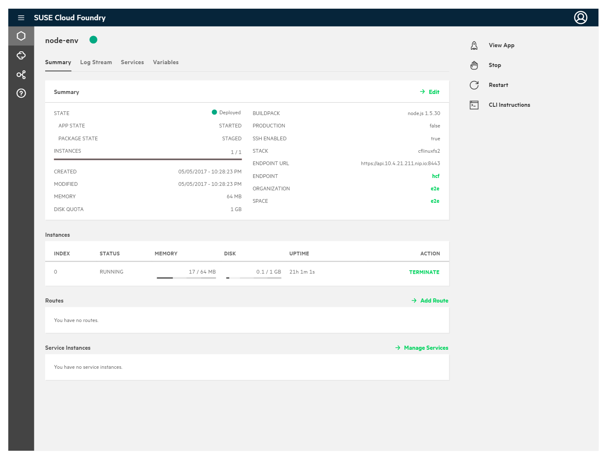

# Stratos UI

Stratos UI is an Open Source Web-based UI (Console) for managing Cloud Foundry. It allows users and administrators to both manage applications running in the Cloud Foundry cluster and perform cluster management tasks.



## Deploying Stratos UI

Stratos UI can be deployed in the following environments:

1. Cloud Foundry, as an application
1. Kubernetes, using a Helm chart
1. Docker, using docker compose

## Quick Start

The quickest way to install Stratos UI is to deploy it as a Cloud Foundry application. To do so, clone the stratos-ui repository, cd into the newly cloned repository and push to Cloud Foundry. This can be done with:

```
git clone git@github.com:hpcloud/stratos-ui.git
cd stratos-ui
cf push
```

You will then be able to open a web browser and navigate to the console URL:

`https://console.<DOMAIN>`

Where `<DOMAIN>` is the default domain configured for your Cloud Foundry cluster.

Note:

1. You need the cf CLI command line tool installed ana available on the path.
1. You need to have configured the cf cli to point to your Cloud Foundry cluster, to be authenticated with your credentials and to be targeted and the organization and space where you wan the console to application be cerated.
1. You may need to configure Application Security Groups on you Cloud Foundry Cluster in order that  Stratos UI can communicate with the Cloud Foundry API.

If you run into issues, please refer to the [Troubleshooting Guide](docs/Troubleshooting.md).

## License

The work done has been licensed under Apache License 2.0. The license file can be found [here](LICENSE.md).

