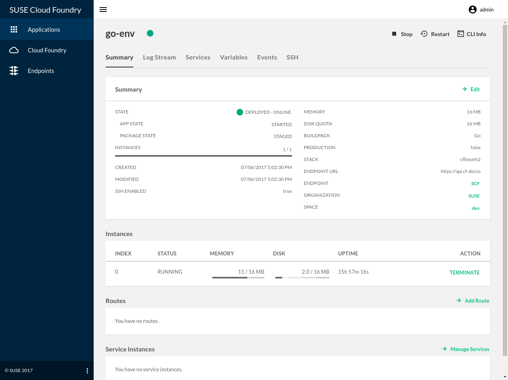

# Stratos

<a href="https://travis-ci.com/suse/stratos/branches"></a>&nbsp;<a style="padding-left: 4px" href="https://codeclimate.com/github/suse/stratos/maintainability"></a>
<a href="https://goreportcard.com/report/github.com/suse/stratos"></a>
<a href="https://codecov.io/gh/suse/stratos/branch/master"></a>
[](https://github.com/suse/stratos/releases/latest)
[](https://github.com/suse/stratos/blob/master/LICENSE)
[](https://cloudfoundry.slack.com/messages/C80EP4Y57/)

Stratos is an Open Source Web-based UI (Console) for managing Cloud Foundry. It allows users and administrators to both manage applications running in the Cloud Foundry cluster and perform cluster management tasks.

If you are looking for a version of Stratos, you can find ..
- V1 in the [v1-master](https://github.com/suse/stratos/tree/v1-master) branch.
- V2 in the [v2-master](https://github.com/suse/stratos/tree/v2-master) branch.



## Quick Start

To get started quickly, we recommend following the steps to deploy the Stratos Console as a Cloud Foundry Application - see [here](deploy/cloud-foundry).

If you have [docker](https://www.docker.com/community-edition) installed, you can quickly deploy Stratos using the all-in-one container:
```
$ docker run -p 4443:443 splatform/stratos:latest 
```

Once that has finished, you can then access Stratos by visiting https://localhost:4443.

## Deploying Stratos

Stratos can be deployed in the following environments:

1. Cloud Foundry, as an application. See [guide](deploy/cloud-foundry)
2. Kubernetes, using a Helm chart. See [guide](deploy/kubernetes)
3. Docker, single container deploying all components. See [guide](deploy/all-in-one)

## Troubleshooting

Please see our [Troubleshooting](docs/troubleshooting) page.

## Further Reading
 
Take a look at the [Feature Set](docs/features.md) for details on the feature set that Stratos provides.
 
Get an [Overview](docs/overview.md) of Stratos, its components and the different ways in which it can be deployed.

Take a look at the [Development Roadmap](docs/roadmap.md) to see where we are heading. We update our status page each week to summarize what we are working on - see the [Status Page](docs/status_updates.md).

Browse through features and issues in the project's [issues](https://github.com/suse/stratos/issues) page.

What kind of code is in Stratos? We've integrated [Code Climate](https://codeclimate.com) for some code quality and maintainability metrics. Take a stroll around the [project page](https://codeclimate.com/github/SUSE/stratos)

## Contributing

We very much welcome developers who would like to get involved and contribute to the development of the Stratos project. Please refer to the [Contributing guide](CONTRIBUTING.md) for more information.

For information to help getting started with development, please read the [Developer's Guide](docs/developers-guide.md).

## Support and feedback

We have a channel (#stratos) on the Cloud Foundy Slack where you can ask questions, get support or give us feedback. We'd love to hear from you if you are using Stratos.

You can join the Cloud Foundry Slack here - https://slack.cloudfoundry.org/  - and then join the #stratos channel.

## Acknowledgements

Tested with Browserstack

<a href="https://www.browserstack.com"></a>

## License

The work done has been licensed under Apache License 2.0. The license file can be found [here](LICENSE).

