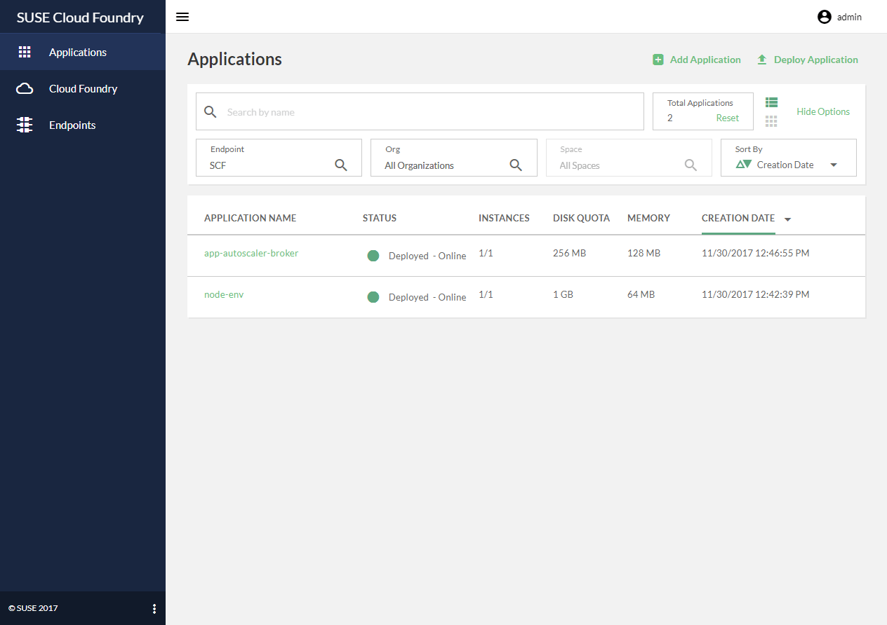

# Stratos

<a href="https://travis-ci.org/cloudfoundry-incubator/stratos"></a>
<a href="https://codeclimate.com/github/cloudfoundry-incubator/stratos"></a>
<a href="https://codecov.io/gh/cloudfoundry-incubator/stratos"></a>
<a href="https://app.zenhub.com/workspace/o/cloudfoundry-incubator/stratos/boards"></a>
[](https://github.com/cloudfoundry-incubator/stratos/releases/latest)
[](https://github.com/cloudfoundry-incubator/stratos/blob/master/LICENSE)

> **NOTE** This is a work-in-progress Angular 2.x version of Stratos. For the current Angular 1 based version see [https://github.com/cloudfoundry-incubator/stratos/tree/master](https://github.com/cloudfoundry-incubator/stratos/tree/master). This version is at an early development stage and we welcome feedback, input and contributions. This version does not currently have feature parity with the Angular 1 version - see the [Development Roadmap](docs/roadmap.md) for more information.

Stratos is an Open Source Web-based UI (Console) for managing Cloud Foundry. It allows users and administrators to both manage applications running in the Cloud Foundry cluster and perform cluster management tasks.

<!--  -->

## Deploying Stratos

Stratos can be deployed in the following environments:

1. Cloud Foundry, as an application. See [guide](deploy/cloud-foundry)
2. Kubernetes, using a Helm chart. See [guide](deploy/kubernetes)
3. Docker, using docker compose. See [guide](deploy/docker-compose)
4. Docker, single container deploying all components. See [guide](deploy/all-in-one)

## Quick Start

To get started quickly, we recommend following the steps to deploy the Stratos Console as a Cloud Foundry Application - see [here](deploy/cloud-foundry).

You can also quickly deploy Stratos, using the all-in-one container:
```
$ docker run -p 4443:443 splatform/stratos-ui:latest 
```

You can access the UI on `https://localhost:4443`

## Project Planning
We use [ZenHub](https://zenhub.com) for project planning. Feel free to head over to the [Boards](https://github.com/SUSE/stratos#boards)
tab and have a look through our pipelines and milestones. Please note in order to view the Github ZenHub Boards tab you will need the [ZenHub
browser extension](https://www.zenhub.com/extension). Alternatively, to view the planning board without the extension visit our [ZenHub Project Page](https://app.zenhub.com/workspace/o/cloudfoundry-incubator/stratos/boards)

## Further Reading
 
Take a look at the [Feature Set](docs/features.md) for details on the feature set that Stratos provides.
 
Get an [Overview](docs/overview.md) of Stratos, its components and the different ways in which it can be deployed.

Take a look at the [Development Roadmap](docs/roadmap.md) to see where we are heading.

Browse through features and issues in the project's [issues](https://github.com/SUSE/stratos-ui/issues) page or [Zenhub Board](https://github.com/SUSE/stratos-ui#boards).

What kind of code is in Stratos? We've integrated [Code Climate](https://codeclimate.com) for some code quality and maintainability metrics. Take a stroll around the [project page](https://codeclimate.com/github/SUSE/stratos)

## Contributing

We very much welcome developers who would like to get involved and contribute to the development of the Stratos project. Please refer to the [Contributing guide](CONTRIBUTING.md) for more information.

For information to help getting started with development, please read the [Developer's Guide](docs/development.md).

## Support and feedback

We have a channel (#stratos) on the Cloud Foundy Slack where you can ask questions, get support or give us feedback. We'd love to hear from you if you are using Stratos.

You can join the Cloud Foundry Slack here - https://slack.cloudfoundry.org/  - and then join the #stratos channel.

## License

The work done has been licensed under Apache License 2.0. The license file can be found [here](LICENSE).
