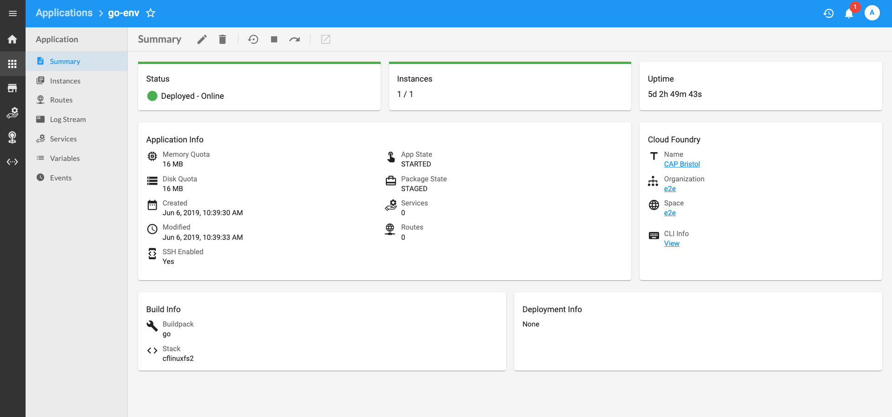

# Stratos

<a href="https://travis-ci.com/cloudfoundry-community/stratos/branches"></a>&nbsp;<a style="padding-left: 4px" href="https://codeclimate.com/github/cloudfoundry-community/stratos/maintainability"></a>
<a href="https://goreportcard.com/report/github.com/cloudfoundry-community/stratos"></a>
<a href="https://codecov.io/gh/cloudfoundry-community/stratos/branch/master"></a>
[](https://github.com/cloudfoundry-community/stratos/releases/latest)
[](https://github.com/cloudfoundry-community/stratos/blob/master/LICENSE)
[](https://cloudfoundry.slack.com/messages/C80EP4Y57/)

Stratos is an Open Source Web-based UI (Console) for managing Cloud Foundry. It allows users and administrators to both manage applications running in the Cloud Foundry cluster and perform cluster management tasks.



Please visit our new [documentation site](https://stratos.app/). There you can discover

1. Our [introduction](https://stratos.app/docs/), including quick start, contributing and troubleshooting guides.
1. How to [deploy](https://stratos.app/docs/deploy/overview) Stratos in a number of environments.
    1. [Cloud Foundry](https://stratos.app/docs/deploy/cloud-foundry/cloud-foundry), as an application.
    1. [Kubernetes](https://stratos.app/docs/deploy/kubernetes), using a Helm chart.
    1. [Docker](https://stratos.app/docs/deploy/all-in-one), as a single container deploying all components.
1. Configuring advanced features such a [Single Sign On](https://stratos.app/docs/advanced/sso) and Cloud Foundry '[invite to org](https://stratos.app/docs/advanced/invite-user-guide)'.
1. Guides for [developers](https://stratos.app/docs/developer/introduction).
1. How to [extend](https://stratos.app/docs/extensions/introduction) Stratos [functionality](https://stratos.app/docs/extensions/frontend) and apply a custom [theme](https://stratos.app/docs/extensions/theming).


## Acknowledgements

Tested with Browserstack

<a href="https://www.browserstack.com"></a>

# Stratos UI pre-packager

This feature helps in pre-building the
[Stratos](https://github.com/cloudfoundry-community/stratos) web application
so that it can be deployed faster in Cloud Foundry, or be run offline.

You can find pre-built versions of Stratos UI in the
[releases](https://github.com/cloudfoundry-community/stratos/releases)
of this repository.

To run those `.zip` packages inside Cloud Foundry, unzip it, write a manifest,
and `cf push` it.

You are not required to have
[stratos-buildpack](https://github.com/SUSE/stratos-buildpack), you can use
binary buildpack.

Here is an example app manifest that worked for us:
```yaml
applications:
  - name: console
    memory: 128M
    disk_quota: 192M
    host: console
    timeout: 180
    buildpack: binary_buildpack
    health-check-type: port
```

For best results rather than pushing manually instead use within the (Genesis CF Kit)[https://github.com/genesis-community/cf-genesis-kit] like so:
```
genesis <env-name> do stratos sgs
```
Note: `sgs` creates security groups the first time, upgrades do not use `sgs`.

## Usage

Golang is required, and version 1.12 is recommended as this is the version used
by the Stratos build system.

When you want to build the `4.1.2` tag in
[Stratos UI releases](https://github.com/cloudfoundry-community/stratos/releases),
run this command:

```
TRAVIS_TAG=4.1.2 ./package.sh
```

### NOTE
The original code for this feature can be found in the [Orange Cloud foundry Github Repository](https://github.com/orange-cloudfoundry/stratos-ui-cf-packager/). 
Many thanks to Benjamin & Arthur, we appreciate you both!

## License

The work done has been re-licensed under MIT License. The license file can be found [here](LICENSE).

