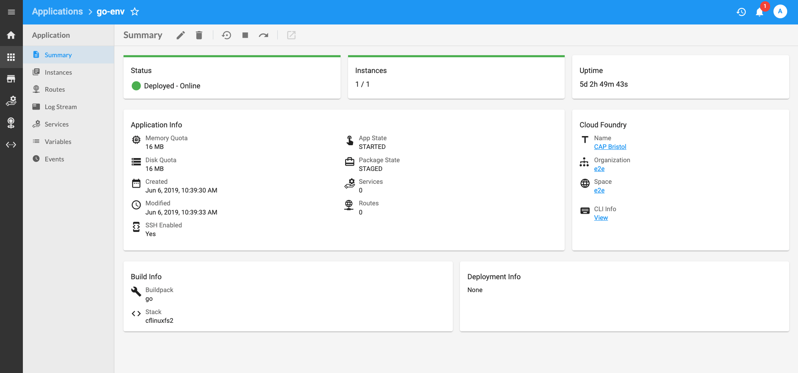

# Stratos

<a style="padding-left: 4px" href="https://codeclimate.com/github/cloudfoundry-community/stratos/maintainability"></a>
<a href="https://goreportcard.com/report/github.com/cloudfoundry/stratos"></a>
<a href="https://codecov.io/gh/cloudfoundry-community/stratos/branch/master"></a>
[](https://github.com/cloudfoundry/stratos/releases/latest)
[](https://github.com/cloudfoundry/stratos/blob/master/LICENSE)
[](https://cloudfoundry.slack.com/messages/C80EP4Y57/)

# Roadmap

Angualr 20 upgrade of frontend code is completed, working on supporting elements.

1. Convert GoLang backend (Jetstream) to use Cloud Foundry V3 API and remove V2 API calls
1. Convert Frontend to call either Jetstream API or V3 API directly. V3 API calls can require more roundtrips than the V2 APIs they replace.

(Please note:  The official repository is at cloudfoundry/stratos and the cloudfoundry-community/stratos will track this but may be used for some testing purposes)

# About

Stratos is an Open Source Web-based UI (Console) for managing Cloud Foundry. It allows users and administrators to both manage applications running in the Cloud Foundry cluster and perform cluster management tasks.



Please visit our new [documentation site](https://stratos.app/). There you can discover (* This is currently being updated from the 4.4.0 docs)

1. Our [introduction](https://stratos.app/docs/), including quick start, contributing and troubleshooting guides.
1. How to [deploy](https://stratos.app/docs/deploy/overview) Stratos in a number of environments.
    1. [Cloud Foundry](https://stratos.app/docs/deploy/cloud-foundry/cloud-foundry), as an application. (Recommended)
    1. [Kubernetes](https://stratos.app/docs/deploy/kubernetes), using a Helm chart.
    1. [Docker](https://stratos.app/docs/deploy/all-in-one), as a single container deploying all components.
1. Configuring advanced features such a [Single Sign On](https://stratos.app/docs/advanced/sso) and Cloud Foundry '[invite to org](https://stratos.app/docs/advanced/invite-user-guide)'.
1. Guides for [developers](https://stratos.app/docs/developer/introduction).
1. How to [extend](https://stratos.app/docs/extensions/introduction) Stratos [functionality](https://stratos.app/docs/extensions/frontend) and apply a custom [theme](https://stratos.app/docs/extensions/theming).

## Developer Workflow

### Prerequisites

- **Node.js 24+** - Required for build system
- **Bun** - Package manager ([installation guide](https://bun.sh))
- **Go 1.21+** - For backend development

### First-Time Setup

On a fresh checkout, run the bootstrap script **once** to initialize the development environment:

```bash
git clone https://github.com/cloudfoundry/stratos.git
cd stratos

# One-time bootstrap (builds required infrastructure)
./bootstrap
# OR
make bootstrap
# OR
bun run bootstrap

# Install dependencies
bun install

# Start development server
make dev-frontend
```

**What bootstrap does:**
1. Verifies prerequisites (Node.js, Bun, Go)
2. Builds the devkit package (required by Angular CLI)
3. Generates extension module imports
4. Creates development proxy configuration
5. Cleans up workspace

**Troubleshooting:**
- If `bun install` fails with missing files: Run `make bootstrap` first
- If builds fail with "File not found" errors: Run `make bootstrap`
- Bootstrap only needs to run once per checkout

### Development Commands

```bash
# Frontend development server (https://127.0.0.1:5440)
make dev-frontend
# OR
bun run start

# Build for production
make build              # Both frontend and backend
make build-frontend     # Frontend only
make build-backend      # Backend only

# Testing
bun test                # All frontend tests
bun run test-frontend:core
bun run test-frontend:cloud-foundry
bun run test-backend    # Backend tests
bun run e2e             # End-to-end tests

# Linting
bun run lint
```

### Full Stack Development

Run these in separate terminals:

```bash
# Terminal 1: Frontend (port 5440)
make dev-frontend

# Terminal 2: Backend API (port 5443)
make dev-backend

# Access at: https://127.0.0.1:5440
```

For more detailed information, see [CLAUDE.md](CLAUDE.md).

## Acknowledgements

Tested with Browserstack

<a href="https://www.browserstack.com"></a>

# Stratos UI pre-packager


This feature helps in pre-building the
[Stratos](https://github.com/cloudfoundry/stratos) web application
so that it can be deployed faster in Cloud Foundry, or be run offline.

You can find pre-built versions of Stratos UI in the
[releases](https://github.com/cloudfoundry/stratos/releases)
of this repository.

To run those `.zip` packages inside Cloud Foundry, unzip it, write a manifest,
and `cf push` it.

You are not required to have
[stratos-buildpack](https://github.com/SUSE/stratos-buildpack), you can use
binary buildpack.

Here is an example app manifest that worked for us:
```yaml
applications:
  - name: console
    memory: 128M
    disk_quota: 192M
    host: console
    timeout: 180
    buildpack: binary_buildpack
    health-check-type: port
```

For best results rather than pushing manually instead use within the (Genesis CF Kit)[https://github.com/genesis-community/cf-genesis-kit] like so:
```
genesis <env-name> do stratos sgs
```
Note: `sgs` creates security groups the first time, upgrades do not use `sgs`.

## Packaging

Golang is required, and version 1.21 is recommended as this is the version used by the Stratos build system.

When you want to build the `4.8.1` tag in
[Stratos UI releases](https://github.com/cloudfoundry/stratos/releases),
run this command:

```bash
./bin/package
```
OR to package a specific tag
```bash
TAG="4.8.1" ./bin/package
```

### NOTE
The original code for this feature can be found in the
[Orange Cloud foundry Github Repository](https://github.com/orange-cloudfoundry/stratos-ui-cf-packager/). 
Many thanks to Benjamin & Arthur, we appreciate you both!

## License

The work done has been re-licensed under MIT License. The license file can be found [here](LICENSE).

