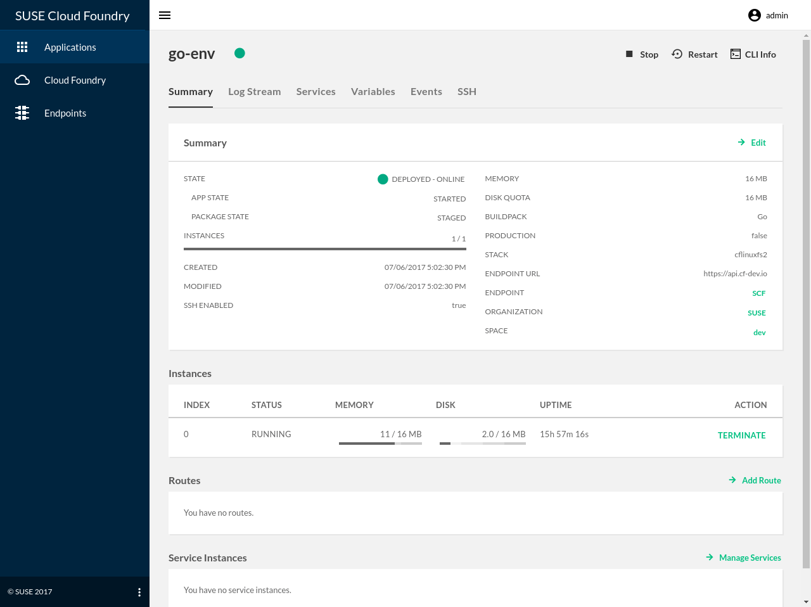

# Stratos

[](https://github.com/cloudfoundry/stratos/actions/workflows/frontend_tests.yml)
[](https://github.com/cloudfoundry/stratos/actions/workflows/backend_tests.yml)
[](https://github.com/cloudfoundry/stratos/actions/workflows/codeql.yml)
[](https://scorecard.dev/viewer/?uri=github.com/cloudfoundry/stratos)
[](https://www.bestpractices.dev/projects/13948)
[](package.json)
[](src/jetstream/go.mod)
[](https://github.com/cloudfoundry/stratos/releases)
[](LICENSE)

## Roadmap

Angular 22 upgrade of frontend code is completed, working on supporting elements.

1. Convert GoLang backend (Jetstream) to use Cloud Foundry V3 API and remove V2 API calls
1. Convert Frontend to call either Jetstream API or V3 API directly. V3 API calls can require more roundtrips than the V2 APIs they replace.

(Please note:  The official repository is at cloudfoundry/stratos and the cloudfoundry-community/stratos will track this but may be used for some testing purposes)

## About

Stratos is an Open Source Web-based UI (Console) for managing Cloud Foundry. It allows users and administrators to both manage applications running in the Cloud Foundry cluster and perform cluster management tasks.



Please visit our new [documentation site](https://stratos.app/). There you can discover (* This is currently being updated from the 4.4.0 docs)

1. Our [introduction](https://stratos.app/docs/), including quick start, contributing and troubleshooting guides.
1. How to [deploy](https://stratos.app/docs/deploy/overview) Stratos in a number of environments.
    1. [Cloud Foundry](https://stratos.app/docs/deploy/cloud-foundry/cloud-foundry), as an application. (Recommended)
    1. [Kubernetes](https://stratos.app/docs/deploy/kubernetes), using a Helm chart.
    1. [Docker](https://stratos.app/docs/deploy/all-in-one), as a single container deploying all components.
1. Configuring advanced features such as [Single Sign On](https://stratos.app/docs/advanced/sso) and Cloud Foundry '[invite to org](https://stratos.app/docs/advanced/invite-user-guide)'.
1. Guides for [developers](https://stratos.app/docs/developer/introduction).
1. How to [extend](https://stratos.app/docs/extensions/introduction) Stratos [functionality](https://stratos.app/docs/extensions/frontend) and apply a custom [theme](https://stratos.app/docs/theming-architecture).

## Developer Workflow

### Prerequisites

- **Node.js 24 or 26** - Required for the build system. The `engines` field is
  `^24 || ^26`, so 25 is not supported.
- **Bun 1.3.14+** - Package manager ([installation guide](https://bun.sh))
- **Go 1.27.1+** - For backend development

These are taken from `engines` in `package.json` and the `go` directive in
`src/jetstream/go.mod`, which are the versions the build and CI actually use.

### First-Time Setup

```bash
git clone https://github.com/cloudfoundry/stratos.git
cd stratos
make install          # bun install; its postinstall step builds the devkit
```

The backend needs `src/jetstream/config.properties` with an encryption key and
a login method before its first start. The
[contributor guide](docs/contributing_guide.md#first-time-setup) has the exact
steps, including a local `admin` user and the dev TLS certificate.

On a fresh worktree, `./bootstrap` also stamps `build-info.ts` so the unit
tests can run before the first build.

### Development Commands

Run every command from the repository root. `make help` lists them all.

```bash
# Development servers, in separate terminals
make dev backend        # https://localhost:5443
make dev frontend       # https://localhost:5440

# Build
make build              # Frontend and every backend platform
make build frontend     # Frontend only
make build backend PLATFORM=linux/amd64   # One backend platform

# Tests and checks
make test frontend      # Unit tests (Vitest)
make test backend       # Go tests
make test e2e           # End-to-end tests (Playwright)
make check gate         # Lint and unit tests, as CI runs them
```

## Stratos UI pre-packager

This feature helps in pre-building the
[Stratos](https://github.com/cloudfoundry/stratos) web application
so that it can be deployed faster in Cloud Foundry, or be run offline.

You can find pre-built versions of Stratos UI in the
[releases](https://github.com/cloudfoundry/stratos/releases)
of this repository.

To run those `.zip` packages inside Cloud Foundry, unzip it, write a manifest,
and `cf push` it.

The zip already contains the `jetstream` binary and the compiled UI, so the push
uses `binary_buildpack` and builds nothing during staging. The old
`stratos-buildpack` source-push path is no longer used.

Here is an example app manifest:

```yaml
applications:
  - name: console
    memory: 512M
    disk_quota: 1024M
    host: console
    timeout: 180
    buildpack: binary_buildpack
    command: ./jetstream
    health-check-type: port
```

For best results rather than pushing manually instead use within the [Genesis CF Kit](https://github.com/genesis-community/cf-genesis-kit) like so:

```bash
genesis <env-name> do stratos sgs
```

Note: `sgs` creates security groups the first time, upgrades do not use `sgs`.

## Packaging

Build the release packages with:

```bash
make build release      # CF zip and GitHub release archives, with SHA256SUMS
make build release cf   # Only the cf push-ready zip (linux/amd64)
```

`VERSION=<semver>` overrides the version taken from `package.json`. The CF zip
is written to `dist/stratos-cf-<version>.zip`; see
[CF Release Build Process](docs/developer-environment.md#cf-release-build-process).

## License

The work done has been re-licensed under the [MIT License](LICENSE).
