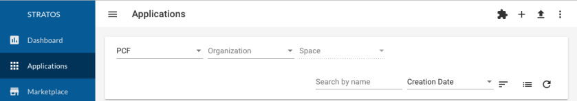

# Front-end Extensions

An example illustrating the various front-end extension points of Stratos is included in the folder `examples/custom-src`.

To include the customizations in this example, either copy or symlink the `examples/custom-src` to `custom-src` at the top-level of the Stratos repository.

Next, run the customization script (this is done automatically when you do an `npm install`) with:

```
npm run customize
```

You can now run Stratos locally to see the customizations - see the [Developer's Guide](developers-guide.md) for details.

For a walk-through of extending Stratos, see [Example: Adding a Custom Tab](#example:-adding-a-custom-tab).

## Extension Points

### Side Navigation

New items can be added to the Side Navigation menu with extensions.

To do so, annotate the routes for your extension with custom metadata, which Stratos will then pick up and add to the side menu.

A full example is in the folder `examples/custom-src/frontend/app/custom/nav-extension`.

Your route should have the following metadata in the `data` field:

```
    stratosNavigation: {
      text: '<TITLE>',
      matIcon: '<ICON NAME>'
    }
```

Where `<TITLE>` is the text label to show in the side navigation and `<ICON NAME>` is the icon to use.

You should place your route declaration in a module named `CustomRoutingModule` in the file `custom-src/frontend/app/custom/custom-routing.module.ts`.

An example routing module would be:

```
import { NgModule } from '@angular/core';
import { Routes, RouterModule } from '@angular/router';

const customRoutes: Routes = [{
  path: 'example',
  loadChildren: 'app/custom/nav-extension/nav-extension.module#NavExtensionModule',
  data: {
    stratosNavigation: {
      text: 'Example',
      matIcon: 'extension'
    }
  }
}];

@NgModule({
  imports: [
    RouterModule.forRoot(customRoutes),
  ],
  declarations: []
})
export class CustomRoutingModule { }
```

This approach ensures that the Angular compiler creates a separate chunk for the extension at compile time.

### Custom Tabs

Tabs can be added to the following views in Stratos:

- The Application view that shows the detail of an application
- The Cloud Foundry view that shows detail for a Cloud Foundry
- The Cloud Foundry Org view that shows detail for a Cloud Foundry organization
- The Cloud Foundry Space view that shows detail for a Cloud Foundry space

For example:


The approach for all of these is the same:

1. Create a new component that will provide the tab contents
2. Ensure that your component is declared with the `ExtensionService` in the imports of your custom module, for example:
```
  @NgModule({
    imports: [
      ExtensionService.declare([
        ExtensionComponent,
      ])
    ],
    declarations: [
      ExtensionComponent
    ]
  })
```

2. Decorate the component with the `StratosTab` decorator, for example:

```
@StratosTab({
  type: StratosTabType.Application,
  label: '<LABEL>',
  link: '<LINK>'
})
```

Where:

- <TYPE> indicates where the tab should appear and can be:
  - StratosTabType.Application - Application View
  - StratosTabType.CloudFoundry - Cloud Foundry view
  - StratosTabType.CloudFoundryOrg - Cloud Foundry Org view
  - StratosTabType.CloudFoundrySpace - Cloud Foundry Space view
- <LABEL> is the text label to use for the tab
- <LINK> is the name to use for the route (this must only contain characters permitted in URLs)

An example is included in the file `examples/custom-src/frontend/app/custom/app-tab-extension`.

### Custom Actions

Actions can be added to the following views in Stratos:

- The Application Wall view that shows all applications
- The Application view that shows the detail of an application
- The Cloud Foundry view that shows detail for a Cloud Foundry
- The Cloud Foundry Org view that shows detail for a Cloud Foundry organization
- The Cloud Foundry Space view that shows detail for a Cloud Foundry space
- The Endpoints view that shows all endpoints

An action is a icon button that appears at the top-right of a View. For example:



The approach for all of these is the same:

1. Create a new component that will provide the contents to show when the action is clicked
2. Ensure that your component is declared with the `ExtensionService` in the imports of your custom module
3. Decorate the component with the `StratosAction` decorator, for example:

```
@StratosAction({
  type: StratosActionType.Applications,
  label: '<LABEL>',
  link: '<LINK>',
  icon: '<ICON>
})
```

Where:

- <TYPE> indicates where the action should appear and can be:
  - StratosActionType.Applications - Application Wall View
  - StratosActionType.Application - Application View
  - StratosActionType.CloudFoundry - Cloud Foundry view
  - StratosActionType.CloudFoundryOrg - Cloud Foundry Org view
  - StratosActionType.CloudFoundrySpace - Cloud Foundry Space view
  - StratosActionType.Endpoints - Endpoints view
- <ICON> is the icon to show
- <LABEL> is the text label to use for the tooltip of the icon (optional)
- <LINK> is the name to use for the route (this must only contain characters permitted in URLs)

An example is included in the file `examples/custom-src/frontend/app/custom/app-action-extension`.

## Example: Adding a Custom Tab

In this example, we will walk through extending the Stratos front-end.

This walk-through assumes that you have installed the Angular CLI globally - this can be done with `npm install -g @angular/cli`.

### Create a new module

First, create the custom-src folder structure - from the top-level of the Stratos repository run:

```
mkdir -p custom-src/frontend/app/custom
mkdir -p /frontend/assets/custom
```

Next, run the customize task:

```
npm run customize
```

This will symlink our custom folder into the Stratos application source folder.

Next, use the Angular CLI to create the root module for our custom code with:

```
ng generate module custom
```

This create a new Angular module `CustomModule`.

Run the customize script again, now that that we have created the custom module with:

```
npm run customize
```

### Create a new Component for our Tab

Create a new Angular component with the CLI:

```
ng generate component custom/example-tab-extension
```

### Add Decorator to make this Component an Extension

In a text editor, open the file:

```
src/frontend/app/custom/example-tab-extension/example-tab-extension.component.ts
```

Add the following decorator to the component at the top of the file:

```
import { StratosTab, StratosTabType } from '../../core/extension/extension-service';

@StratosTab({
  type: StratosTabType.Application,
  label: 'Example App Tab',
  link: 'example'
})
```

The file should now look like this:

```
import { Component, OnInit } from '@angular/core';
import { StratosTab, StratosTabType } from '../../core/extension/extension-service';

@StratosTab({
  type: StratosTabType.Application,
  label: 'Example App Tab',
  link: 'example'
})
@Component({
  selector: 'app-example-tab-extension',
  templateUrl: './example-tab-extension.component.html',
  styleUrls: ['./example-tab-extension.component.scss']
})
export class ExampleTabExtensionComponent implements OnInit {

  constructor() { }

  ngOnInit() {
  }

}
```

Save the file.


### Mark the component as an extensions component

The last thing we need to do is to mark our Extension component as an extensions component.

To do this, in a text editor, open the file `src/frontend/app/custom/custom.module.ts` and add the `ExtensionService.declare` to the import sesion, so it looks like this:

```
@NgModule({
  imports: [
    CommonModule,
    ExtensionService.declare([
      ExampleTabExtensionComponent,
    ])    
  ],
  declarations: [ExampleTabExtensionComponent],
  entryComponents: [ExampleTabExtensionComponent]
})
export class CustomModule { }
```

### Run it

You should now be able to run Stratos locally and see this new tab on the application page for an application - as illustrated below:


