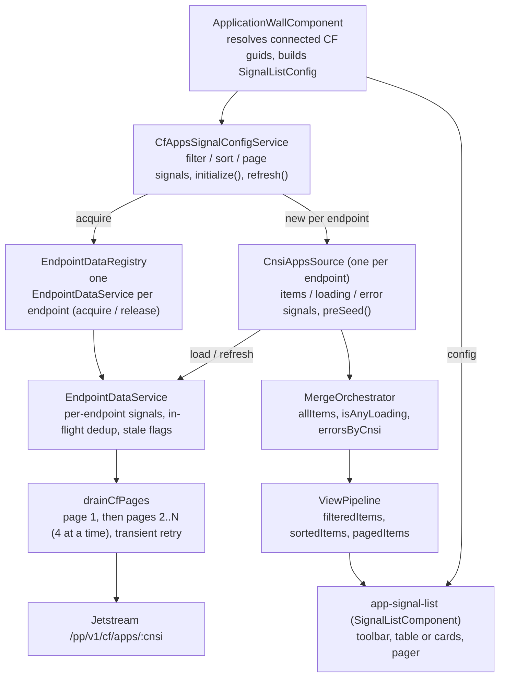

# Pagination Architecture

Developer guide to how Stratos lists load, page, sort, filter and render
endpoint data. Lists are built on Angular signals: each Cloud Foundry
endpoint's collection is drained in full on the client, merged across
endpoints, and then filtered, sorted and sliced into pages in memory. The
application wall is used as the worked example throughout.

All paths below are relative to `src/frontend/packages/`.

## System Overview

## Key Files

| File | Purpose |
|------|---------|
| `cloud-foundry/src/services/endpoint-data/drain-pages.ts` | `drainCfPages()` — client-side page drain with per-page transient retry |
| `cloud-foundry/src/services/endpoint-data/endpoint-data.service.ts` | `EndpointDataService` — per-endpoint data cache (counts, orgs, apps, spaces, services) |
| `cloud-foundry/src/services/endpoint-data/endpoint-data.registry.ts` | `EndpointDataRegistry` — ref-counted, sticky map of `EndpointDataService` instances plus the home-page warm-up queues |
| `cloud-foundry/src/services/data-sources/cnsi-entity-source.ts` | `CnsiEntitySource<T>` — abstract per-endpoint list source |
| `cloud-foundry/src/services/data-sources/cnsi-apps-source.ts` | `CnsiAppsSource` — apps source that joins the `EndpointDataService` drain |
| `cloud-foundry/src/services/data-sources/cnsi-*-source.ts` | Other per-entity sources (orgs, spaces, routes, service instances, audit events, …) |
| `cloud-foundry/src/services/data-sources/merge-orchestrator.ts` | `MergeOrchestrator<T>` — merges items, loading and errors across endpoints |
| `cloud-foundry/src/services/data-sources/view-pipeline.ts` | `ViewPipeline<T>` — in-memory filter, sort and page slice |
| `cloud-foundry/src/services/data-sources/cascade-registry.ts` | Which entity slices a mutation marks stale |
| `cloud-foundry/src/shared/signal-list-configs/endpoint-error-reporting.ts` | `wireEndpointErrorReporting()` — forwards `errorsByCnsi` to the error banner |
| `core/src/shared/components/signal-list/signal-list.component.ts` | `SignalListComponent` (`app-signal-list`) and the `SignalListConfig<T>` interface |
| `core/src/shared/components/signal-list/list-state-store.service.ts` | `ListStateStore` — per-list view mode, page size, page index and sort, persisted to `localStorage` |
| `core/src/shared/components/signal-list/page-size.types.ts` | `PAGE_SIZE_ALL` sentinel and page-size helpers |
| `cloud-foundry/src/shared/signal-list-configs/app/cf-apps-signal-config.service.ts` | Example config service: application wall |
| `cloud-foundry/src/features/applications/application-wall/application-wall.component.ts` | Example consumer: application wall |

## Data Flow

### Component to HTTP

1. `ApplicationWallComponent.ngOnInit()` takes the first emission of
   `CloudFoundryService.connectedCFEndpoints$`, extracts the endpoint
   guids, and calls `CfAppsSignalConfigService.initialize(cnsiGuids)`.
2. `initialize()` calls `EndpointDataRegistry.acquire(guid)` for each
   endpoint and creates one `CnsiAppsSource` per endpoint, passing in the
   acquired `EndpointDataService`. If that service already holds a
   completed apps drain (`appsLastFetched() !== null`), the source is
   seeded synchronously with `preSeed(eds.apps())` so rows paint on mount.
3. The sources are wrapped in a `MergeOrchestrator`, and a `ViewPipeline`
   is built over the orchestrator's merged items plus the config's
   `filter`, `sort`, `pageSize` and `pageIndex` signals.
4. The wall builds a `SignalListConfig` from the pipeline and orchestrator
   signals and hands it to `app-signal-list`.
5. The wall calls `loadAll()`, which calls `orchestrator.load()`. That
   calls `load()` on every source in parallel.
6. `CnsiAppsSource.load()` calls `EndpointDataService.loadApps()`, which
   either returns immediately (warm cache), joins an in-flight drain, or
   starts `drainCfPages()` against `/pp/v1/cf/apps/{cnsi}`.

### HTTP back to the component

1. `drainCfPages()` resolves to one `{ resources, totalResults, totalPages }`
   envelope. `EndpointDataService` writes `resources` into its `apps`
   signal and stamps `appsLastFetched`.
2. `CnsiAppsSource` copies the result into its own `items` signal via
   `preSeed(eds.apps())`.
3. `MergeOrchestrator.allItems` (a `computed` over every source's `items`)
   recomputes, and `ViewPipeline` recomputes `filteredItems`,
   `sortedItems` and `pagedItems` in turn.
4. `SignalListComponent` reads `pagedItems`, `totalFilteredResults` and
   `totalPages` directly in its template. There are no subscriptions in
   this path; change propagation is signal dependency tracking.

## Client-Side Page Draining

Lists need the full collection to sort and filter it, so every page is
fetched before a list is complete. There are two drain implementations.

### `drainCfPages()`

Used by `EndpointDataService` (orgs, apps, spaces, and their refresh
variants), `CnsiUsersSnapshotService`, `CfUsersPagedDataService` and the
foundation-shape measurement service.

- Requests `per_page=500`.
- Fetches page 1 first and reads `pagination.totalPages` (falling back to
  a flat `totalResults` envelope for older handlers).
- Fetches pages 2..N with `mergeMap` at a concurrency of 4, then reduces
  all pages into a single resource array.
- Retries each page individually, up to two times with 500 ms and 1 s
  delays, when the error is transient: HTTP status 0, 502, 503 or 504, or
  a response carrying `X-Stratos-Error-Reason: unreachable`. Any other
  error fails the drain immediately.

### `CnsiEntitySource._doLoad()`

The base drain for per-endpoint sources that are not backed by
`EndpointDataService`.

- Requests `/pp/v1/cf/{entity}/{cnsi}?return=summary&per_page={pageSize}&page={n}`.
  The default page size is 100; subclasses can pass another value.
- Fetches page 1, then pages 2..N with four async workers.
- Does not retry. The first page error stops the remaining workers and
  sets the source's `error` signal.
- Subclasses can set `maxPages` to cap the drain. `CnsiAuditEventsSource`
  uses 50 pages of 500, relying on the handler ordering newest-first.
- An optional `adaptResource()` hook transforms each wire resource into
  the source's row type.

`CnsiAppsSource` overrides `load()` and `refresh()` to use
`EndpointDataService.loadApps()` / `refreshApps()` instead, so the apps
wall and the home page share one apps drain per endpoint. It falls back
to the base drain when constructed without an `EndpointDataService`.

## Per-Endpoint Sources

`CnsiEntitySource<T>` exposes read-only signals: `items`, `loading`,
`error`, `done`, `fetchedPages` and `totalResults`.

**Cold load** (no rows yet): `loading` goes true, `items` is cleared, and
rows are appended page by page as they arrive, so large foundations
render progressively.

**Warm load** (rows already present from `preSeed()` or a previous load):
the drain runs without setting `loading` and without clearing `items`.
Pages collect in a buffer and replace `items` in one write when the drain
finishes. If the drain fails, the previous rows stay visible and `error`
is set. This is the stale-while-revalidate path: `preSeed()` only paints;
the next `load()` still revalidates against the backend.

Other source behaviour:

- `load()` is deduplicated: concurrent calls share one in-flight promise.
- `refresh()` calls `load()` in the base class.
- `loadOne(guid)` fetches a single row when the subclass defines
  `urlForOne()`, with its own per-guid in-flight map.
- `removeItem(guid)` drops a row locally and decrements `totalResults`,
  used after a successful delete so the row disappears without a refetch.

## EndpointDataService and EndpointDataRegistry

`EndpointDataService` is a plain class (not injectable), one instance per
endpoint, holding signals for counts, full org/app/space lists, services
data, loading flags, errors and freshness timestamps.

### Registry

`EndpointDataRegistry` is a root service mapping endpoint guid to
`{ service, refCount }`.

- `acquire(guid)` returns the existing instance and increments its
  reference count, or creates one and enqueues its card load.
- `release(guid)` decrements the reference count only. Instances and
  their data stay in the map for the rest of the session; there is no
  eviction method.
- `peek(guid)` returns an existing instance without creating one or
  changing the count.

New instances flow through three queues: a card queue that runs
`load()` (counts and recent apps) with a concurrency of 2 by default
(`configure()` changes it), a serial details queue that runs
`loadDetails()` (full orgs, apps and spaces) once the browser is idle, and
a serial pre-warm queue for services details and the users snapshot.
The first `acquire()` for an endpoint, typically from its home-page card,
therefore warms the caches that other list pages read later.

### Caching and dedup

Each loader (`load`, `loadDetails`, `loadOrgs`, `loadApps`, `loadSpaces`)
follows the same pattern:

1. **Warm-cache short-circuit.** If the slice has a `lastFetched` stamp,
   is non-empty and is not stale, return `of(undefined)` with no request.
2. **In-flight dedup.** If a drain for the slice is already running,
   return the same shared observable (`shareReplay`, `refCount: false`),
   so concurrent callers and unsubscribing callers do not start or abort
   duplicate requests.
3. Otherwise start the drain. The `lastFetched` stamp is written only on
   success, so a failed drain leaves the slice cold and the next read
   retries.

`loadDetails()` merges the three per-domain loaders, so a page that only
needs orgs can call `loadOrgs()` and skip the apps and spaces drains.

### Staleness and refresh

- After a successful create or update, sources call
  `applyCascade(key)`. `cascade-registry.ts` maps the key to the entity
  slices it affects, and `markStale()` sets their stale flags. A stale
  slice is treated as uncached on its next read.
- Deletes go through `EntityDeleteController`, which derives the affected
  slices from the relation graph rather than the cascade registry.
- `refreshOrgs()`, `refreshApps()`, `refreshSpaces()` and
  `refreshDetails()` always re-drain, bypassing both the warm cache and
  the in-flight dedup.

For the application wall, the toolbar refresh button calls
`CfAppsSignalConfigService.refresh()`, which calls
`orchestrator.refresh()`, which calls `CnsiAppsSource.refresh()` on each
endpoint, which calls `refreshApps()`.

## Multi-Endpoint Merging

`MergeOrchestrator<T>` takes the array of per-endpoint sources and
exposes computed signals:

| Signal | Value |
|--------|-------|
| `allItems` | Every source's `items`, concatenated in source order |
| `isAnyLoading` | True while any source's `loading` is true |
| `errorsByCnsi` | `Map` of endpoint guid to error for each source whose `error` is set |
| `totalAcrossCnsis` | Sum of each source's `totalResults` |

`load()` and `refresh()` run the corresponding source method on every
source in parallel. `removeRow(cnsiGuid, guid)` forwards to the matching
source's `removeItem()`.

A failure on one endpoint does not block the others: its rows are absent
(or, after a warm load, retained) and its error appears in
`errorsByCnsi`. The application wall, service instances and service
offerings config services each build a `MergeOrchestrator` and pass
`errorsByCnsi` to `wireEndpointErrorReporting()`, which records the errors
in `EndpointErrorEventsService` for the page-header error banner and the
errors page.

## Paging, Sorting and Filtering

All three happen in memory in `ViewPipeline<T>`, built from five signals
(items, filter predicate, sort spec, page size, page index) and an
optional map of sort-key extractors.

| Signal | Computation |
|--------|-------------|
| `filteredItems` | `items().filter(filter())` |
| `sortedItems` | Copy of `filteredItems` sorted by `sort()` |
| `pagedItems` | Slice of `sortedItems` for the current page |
| `totalItems` | Unfiltered item count |
| `totalFilteredResults` | Filtered item count, used by the pager and empty states |
| `totalPages` | `ceil(totalFilteredResults / pageSize)` |

**Filtering.** The config service owns a `filter` signal holding a
predicate. On the application wall an `effect` rebuilds the predicate
whenever a toolbar input changes (endpoint, org, space, stack, status,
last-refreshed range, text filter and filter field). Writing a new
function to the signal makes `filteredItems` recompute. Space scoping on
the per-space apps tab narrows the item set before the pipeline rather
than through the user filter, so `totalItems` reflects the scope.

**Sorting.** The sort spec is `{ field, direction, caseSensitive? }`. The
value comes from a registered extractor for that field if one exists
(for columns rendered from several properties), otherwise from
`row[field]`. Nulls sort last; two numbers compare numerically; two
strings use `naturalCompare` from `@stratosui/core`, after a
`detectSortContext` pass over all values so names like `Org 4`, `Org_5`
and `Org6` order by their numeric part. String comparison is
case-insensitive unless `caseSensitive` is set.

**Paging.** A page size of 0 or less returns every row. Otherwise the
page index is clamped to the last available page before slicing, because
the stored index can outlive a larger data set.

### List state

`ListStateStore.bind(key, defaults)` returns the view mode, page size,
page index and sort as signals. Page size, page index and sort are each
stored as a `[card, table]` tuple, and the exposed `pageSize`, `pageIndex`
and `sort` signals read and write the slot for the current view mode, so
each mode keeps its own values. The application wall binds the key
`cf-apps` with page sizes `[24, 25]`.

- View mode, page size and sort persist to `localStorage` under
  `stratos.list-state.v1.<key>`. Stored values that fail validation are
  ignored in favour of the defaults.
- Page index is not restored from storage. Within a session it is kept,
  and `resetPageOnScopeChange(scopeKey)` resets it to the default when a
  config service initializes with a different data scope (for the wall,
  the endpoint guids plus any locked space).

### Page size options and "All"

`SignalListConfig.pageSizeOptions` is either one array or a
`{ table, card }` record. With the per-mode form, card view always offers
`-1` ("All"), appended if the config omits it; table view offers only the
configured sizes. With no options configured the list uses
`[5, 20, 50, 80]`.

`-1` is the `PAGE_SIZE_ALL` sentinel defined in `page-size.types.ts`. The
list writes it to the `pageSize` signal as-is, and `ViewPipeline` treats
any non-positive size as "return all rows". Selecting a page size,
sorting by a column header, or a view toggle that changes the page size
resets the page index to 0. Switching view mode snaps the page size to
the first option of the new mode when the current size is not offered
there.

## Rendering, Loading and Error State

`SignalListComponent` (`app-signal-list`) is an `OnPush` standalone
component driven entirely by `SignalListConfig<T>`. It renders the
toolbar (filters, view toggle, header actions, refresh), a table or card
grid from `pagedItems`, and the pager (page-size select, range text,
first/previous/next/last).

Loading and error state come from two config signals and one internal
signal:

- `config.isAnyLoading` — supplied by the config service; for
  orchestrator-backed lists this is `MergeOrchestrator.isAnyLoading`.
- `isRefreshing` — internal to the component; true while the
  `onRefresh` callback started by the refresh button is pending.
- `config.errorsByCnsi` — per-endpoint errors.

| Condition | Rendered |
|-----------|----------|
| Loading or refreshing, and no rows | Full-area loader with `loadingMessage` |
| Loading or refreshing, with rows | Rows stay visible; refresh button shows a spinner and is disabled |
| `errorsByCnsi` non-empty | Error strip listing each failed endpoint |
| No rows and `errorsByCnsi` non-empty | Error empty state with `errorMessage` and a Retry button wired to `onRefresh` |
| No rows, a filter active | `emptyFilterMessage` |
| No rows | `emptyMessage` |

Because a warm load does not set `loading`, a revalidation over cached
rows is silent: the rows stay in place and swap when the drain finishes.

## Polling

List data is not polled. It loads on initialize and reloads on refresh
or when a stale slice is next read.

The application wall polls one derived value: per-instance app stats for
the Instances column. `CfAppsSignalConfigService.startStatsPolling()`
(default interval 30 s) requests stats only for the rows in
`view.pagedItems()`, batched into one
`/pp/v1/cf/app-stats/{cnsi}?app_guids=…` request per endpoint. An
`effect` on `pagedItems` also fetches immediately when the visible page
changes. Keys already in flight are skipped, and on error the previous
values are kept so the next tick retries.

## Common Pitfalls

1. **Seed with `preSeed()`, then still call `load()`.** The seed only
   paints; skipping the load leaves out-of-band changes invisible until a
   hard refresh.
2. **Use the `refreshX()` methods for user-initiated refresh.** The
   `loadX()` methods return immediately on a warm, non-stale cache.
3. **Call `applyCascade()` after create and update writes.** Without it,
   related slices on other pages keep serving cached data.
4. **Do not stamp freshness on failure.** Every loader sets its
   `lastFetched` stamp only on success; new loaders should do the same so
   a failed drain is retried on the next read.
5. **Call `resetPageOnScopeChange()` from every initialize path.** Without
   it, a page index from a larger previous data set carries over.
6. **Rebuild `wireEndpointErrorReporting()` on each initialize.** The
   orchestrator is rebuilt each time, and the effect must track the new
   instance's `errorsByCnsi`.
